# 🧩 AisDrop — Платформа онлайн-объявлений

[](LICENSE)

---

## О проекте

AisDrop — это полнофункциональная платформа для размещения онлайн-объявлений, вдохновлённая OLX.  
Проект сделан с нуля для практики fullstack-разработки и создания MVP продукта с современным стеком технологий.

---

## Основной функционал

-   Публикация объявлений с указанием названия, цены, описания, фото, категории и геопозиции
-   Редактирование и удаление собственных объявлений
-   Регистрация, авторизация и управление профилем пользователя
-   Счётчик просмотров объявлений
-   Добавление объявлений в избранное
-   Реалтайм чат на WebSocket между покупателем и продавцом
-   Мгновенные уведомления о новых сообщениях
-   Отображение объявлений на карте с помощью геолокации
-   Админ-панель для модерации, управления жалобами и статистикой
-   Система жалоб и фильтрация нежелательных пользователей
-   Полная адаптивность для мобильных устройств

---

## Технологический стек

| Компонент          | Технология                     |
| ------------------ | ------------------------------ |
| Backend            | PHP (Laravel Framework)        |
| Frontend           | React, JavaScript, TailwindCSS |
| База данных        | MySQL                          |
| Реалтайм           | WebSockets (Laravel Reverb)    |
| Вёрстка            | HTML, CSS, TailwindCSS         |
| Другие инструменты | Composer, Docker (при деплое)  |

---

## Установка и запуск

1. Клонируйте репозиторий:

    ```bash
    git clone https://github.com/yourusername/aisdrop.git
    ```

2. Установите зависимости:
    ```bash
    composer install
    npm install
    npm run dev
    ```
3. Настройте файл .env (создайте копию .env.example):
    ```bash
    DB_CONNECTION=mysql
    DB_HOST=127.0.0.1
    DB_PORT=3306
    DB_DATABASE=aisdrop
    DB_USERNAME=root
    DB_PASSWORD=
    ```
4. Выполните миграции и сиды базы данных:
    ```bash
    php artisan migrate --seed
    ```
5. Запустите сервер Laravel, reverb(webSocket), Worker:
    ```bash
    php artisan serve
    php artisan reverb:start
    php artisan queue:work
    npm run dev # опционально
    ```

> Демонстрация

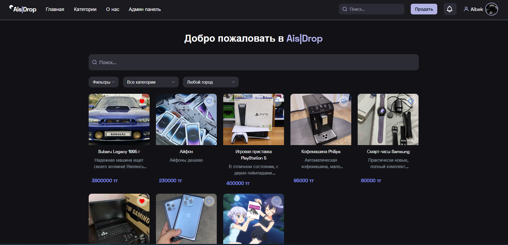
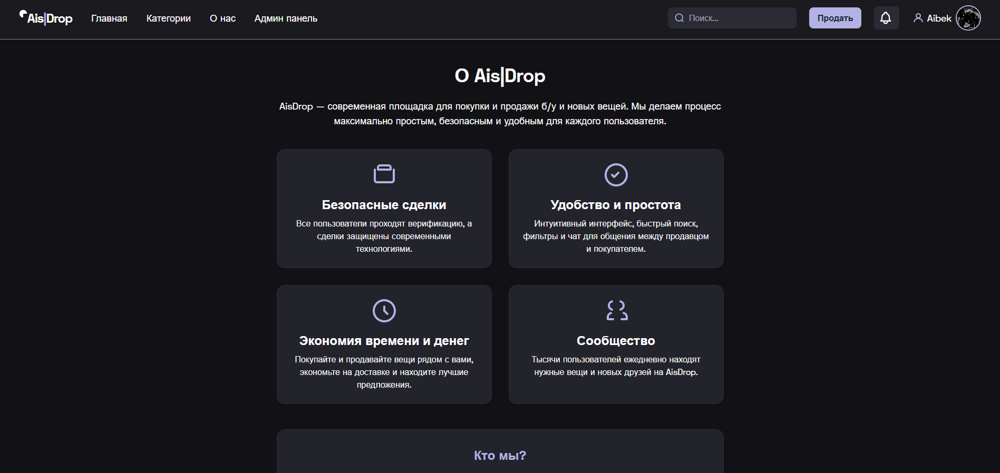
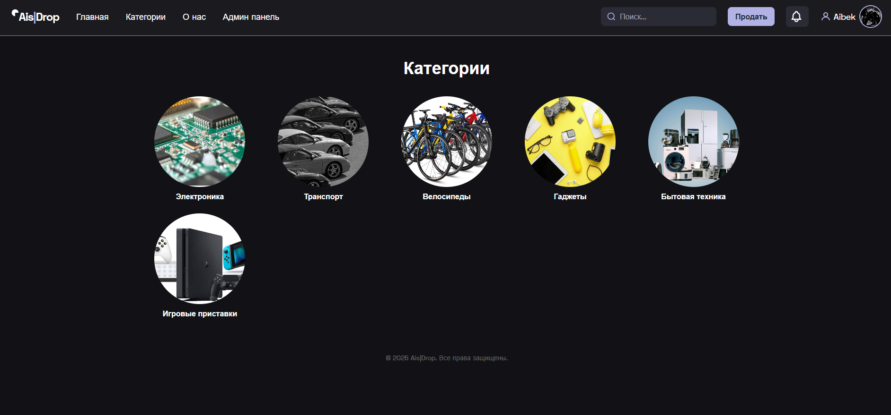
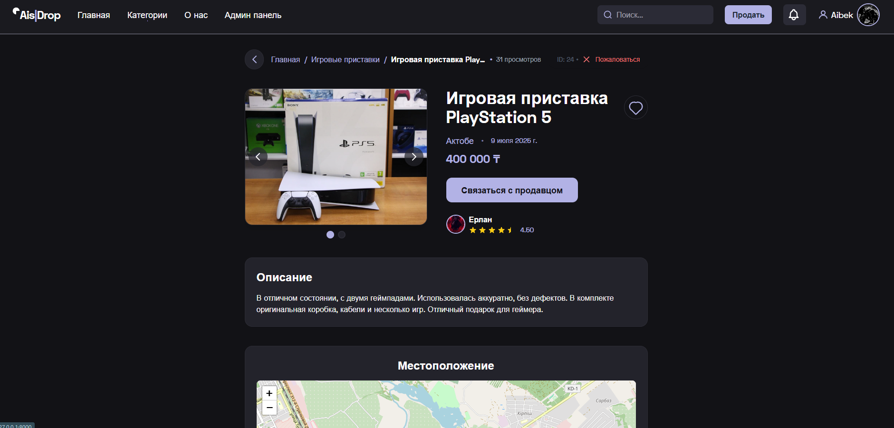
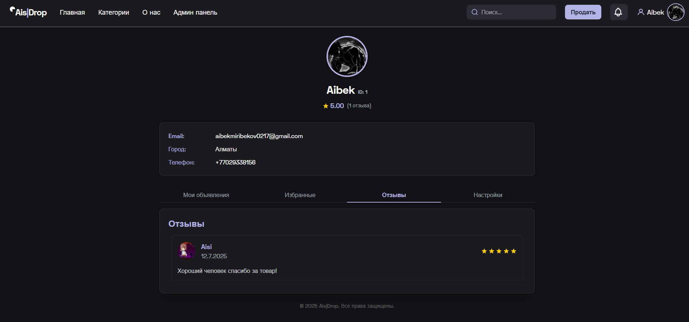
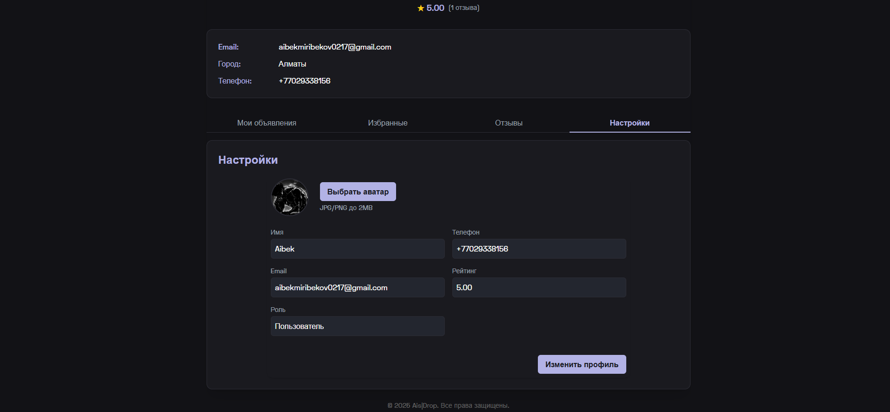
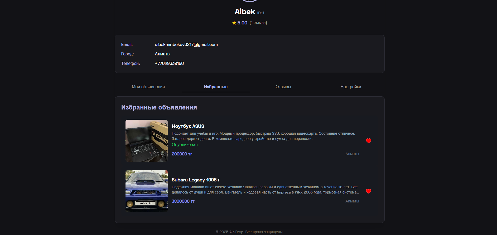
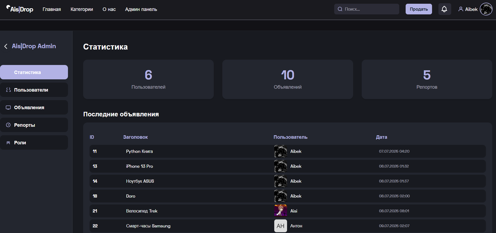

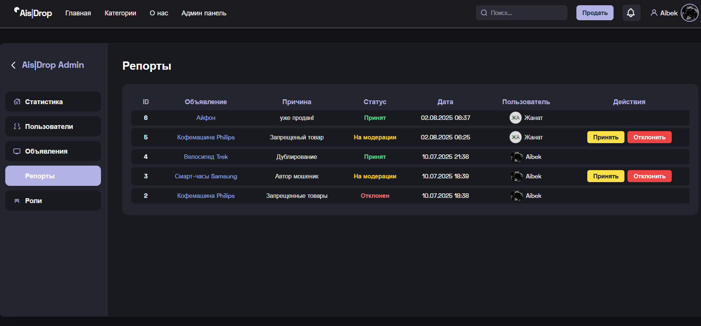
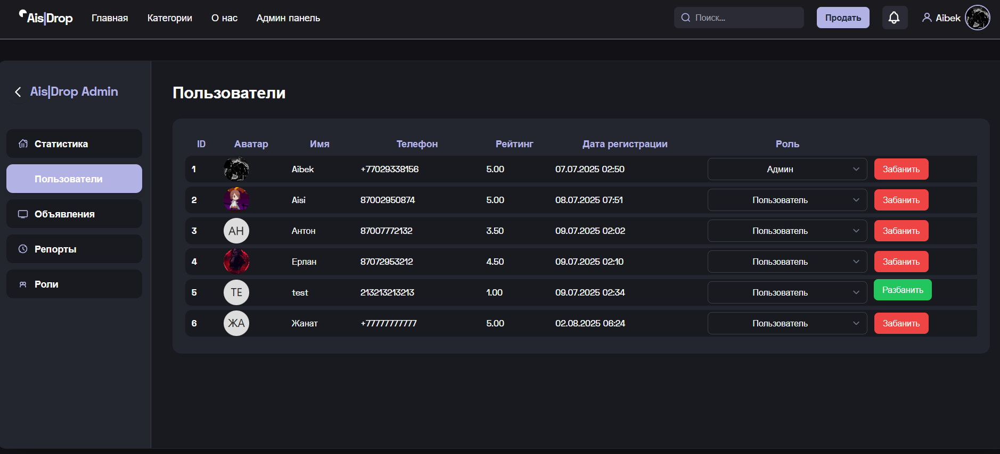
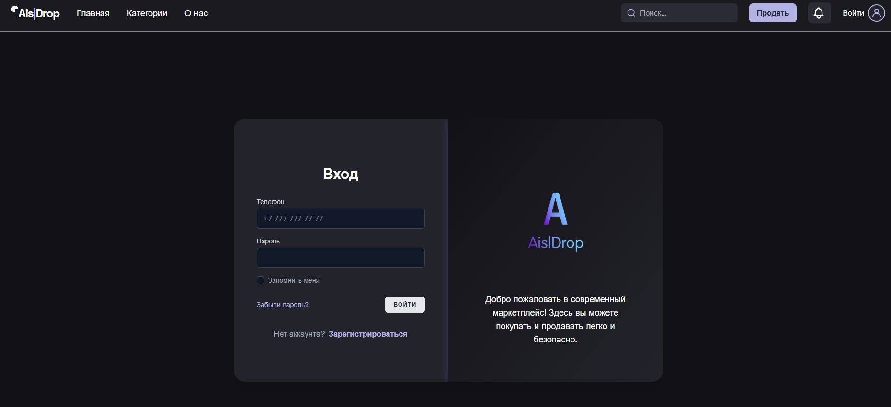
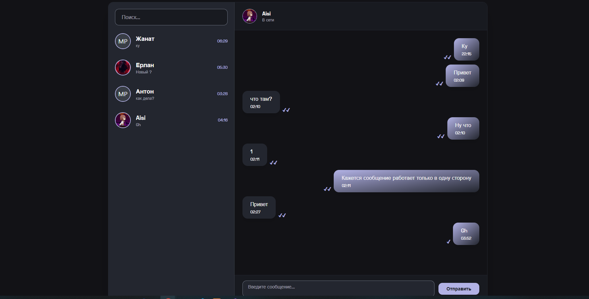
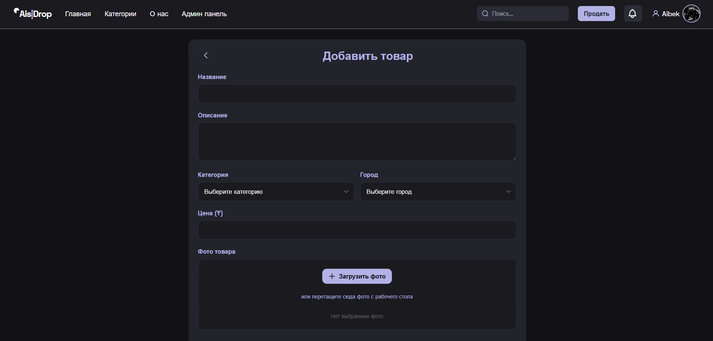

# Особенности и вызовы

-   Реализация WebSocket на Laravel Reverb для поддержки реального времени
-   Адаптивный дизайн с использованием TailwindCSS
-   Продуманная система репортов и модерации для обеспечения безопасности и удобства пользователей
-   Отзывы пользователей и жалобы могут быть отправлены администратору, чтобы улучшить качество сервиса
-   Репорты пользователей могут быть отправлены администратору или модератору, чтобы проверить или пользователя или объявление

# Планы на будущее

-   Добавить расширенный поиск с фильтрами по различным параметрам
-   Реализовать push-уведомления для мобильных устройств
-   Оптимизировать нагрузку на WebSocket-сервер
-   Внедрить систему рейтингов и отзывов для пользователей и объявлений
-   Улучшить UI/UX на основе обратной связи

# Контакты

Если хотите связаться — пишите: [Telegram](https://t.me/aisblackm)
